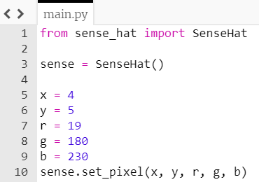

## Ρύθμιση τυχαίων εικονοστοιχείων

Αρχικά, θα σκεφτούμε μερικούς τυχαίους αριθμούς και θα χρησιμοποιήσουμε τη συνάρτηση `set_pixel` για να τοποθετήσουμε ένα τυχαίο χρώμα σε μια τυχαία θέση στην οθόνη Sense HAT.

+ Άνοιξε το πρόγραμμα επεξεργασίας IDLE.

[[[rpi-gui-idle-opening]]]

+ Δημιούργησε ένα νέο αρχείο και αποθήκευσέ το ως `sparkles.py`.

+ Στο νέο αρχείο, ξεκίνησε κάνοντας import το module `SenseHat`:

    ```python
    from sense_hat import SenseHat
    ```

+ Στη συνέχεια, δημιούργησε μια σύνδεση με το δικό σου Sense HAT προσθέτοντας αυτήν τη γραμμή κώδικα:

    ```python
    sense = SenseHat()
    ```


Στη συνέχεια θα ορίσουμε τα x και y, για να επιλέξουμε ποιο εικονοστοιχείο στο Sense HAT θα ανάψει.

+ Δημιούργησε μια μεταβλητή με όνομα `x` και τιμή έναν αριθμό της επιλογής σου μεταξύ 0 και 7. Αυτή θα είναι η συντεταγμένη x του εικονοστοιχείου σου στην οθόνη. 

[[[generic-python-creating-a-variable]]]

+ Δημιούργησε μια άλλη μεταβλητή με όνομα `y` και τιμή έναν άλλο αριθμό μεταξύ 0 και 7. Αυτή θα είναι η συντεταγμένη y του εικονοστοιχείου σου στην οθόνη.


+ Για να επιλέξεις το χρώμα του εικονοστοιχείου, σκέψου τρεις αριθμούς μεταξύ 0 και `255` και στη συνέχεια, αντιστοίχισέ τους στις μεταβλητές με ονόματα `r`, `g`, και `b`. Αυτές οι μεταβλητές θα αντιπροσωπεύουν το χρώμα του εικονοστοιχείου (pixel) σου ως ποσότητες κόκκινου (r), πράσινου (g) και μπλε (b).


+ Τώρα χρησιμοποίησε τη συνάρτηση `set_pixel` για να τοποθετήσεις ένα εικονοστοιχείο σύμφωνα με το τυχαίο χρώμα και στην τυχαία θέση στην οθόνη που επέλεξες.

**Σημείωση:** Οι οδηγίες που ακολουθούν χρησιμοποιούν διαφορετικό όνομα αρχείου από το δικό σου και χρησιμοποιούν Trinket αντί για IDLE.

[[[rpi-sensehat-single-pixel]]]

Η μέθοδος `set_pixel` Η λαμβάνει δεδομένα με την ακόλουθη σειρά: x συντεταγμένη (τετμημένη), y συντεταγμένη (τεταγμένη), κόκκινο, πράσινο, μπλε

Για να ορίσεις τη συνάρτηση `set_pixel`, αντικατάστησε στη γραμμή κώδικα που ακολουθεί, τα ονόματα των μεταβλητών σου στη θέση των ερωτηματικών με τη σωστή σειρά: συντεταγμένη x, συντεταγμένη y, κόκκινο, πράσινο, μπλε.

```python
sense.set_pixel (?,?,?,?,?)
```

Δες την παρακάτω υπόδειξη, εάν έχεις μπερδευτεί.

--- hints ---


--- hint ---

Έτσι θα φαίνεται ο τελικός σου κώδικας - πιθανότατα θα έχεις επιλέξει διαφορετικούς αριθμούς:



--- /hint ---

--- /hints ---


+ Εκτέλεσε τον κώδικά σου πατώντας <kbd>F5</kbd>. Θα πρέπει να δεις ένα μόνο LED να ανάβει στην οθόνη LED του Sense HAT.

+ Τώρα άλλαξε όλους τους αριθμούς στο πρόγραμμά σου και εκτέλεσε ξανά το πρόγραμμα. Ένα δεύτερο LED πρέπει να ανάψει.
