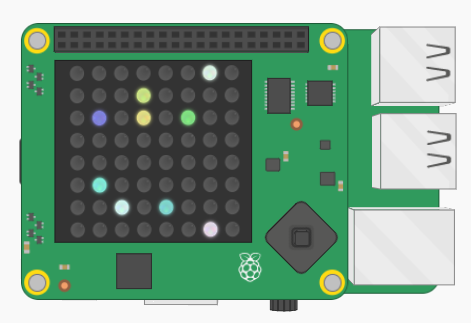

## Χρησιμοποιώντας το module `random`

Μέχρι στιγμής έχεις επιλέξει τους δικούς σου τυχαίους αριθμούς, αλλά μπορείς να αφήσεις τον υπολογιστή να τους επιλέξει χρησιμοποιώντας το module `random`.

+ Πρόσθεσε άλλη μια γραμμή `import` στην **αρχή** του προγράμματός σου:

```python
from random import randint
```

+ Άλλαξε τις τιμές των μεταβλητών `x` και `y` με τυχαίους αριθμούς μεταξύ 0 και 7. Τώρα το πρόγραμμά σου θα επιλέγει αυτόματα μια τυχαία θέση στον πίνακα LED.

[[[generic-python-random]]]

+ Εκτέλεσε ξανά το πρόγραμμά σου και θα πρέπει να δεις ένα άλλο τυχαίο pixel να εμφανίζεται στην οθόνη του Sense HAT. Θα είναι ίδιο χρώμα με αυτό που επέλεξες προηγουμένως.

+ Άλλαξε τις τιμές των μεταβλητών `r`, `g`, και `b` με τυχαίους αριθμούς μεταξύ 0 και 255. Τώρα το πρόγραμμά σου θα επιλέξει αυτόματα ένα τυχαίο χρώμα.

+ Εκτέλεσε ξανά το πρόγραμμα και θα πρέπει να δεις ένα άλλο εικονοστοιχείο να εμφανίζεται σε μια τυχαία θέση, αυτή τη φορά με ένα τυχαίο χρώμα.

+ Εκτέλεσε το πρόγραμμα μερικές ακόμη φορές και θα πρέπει να δεις την οθόνη να γεμίζει με τυχαία εικονοστοιχεία.

Εάν έχεις την γραμμή `sense.clear ()` στον κώδικά σου, θα πρέπει να την αφαιρέσεις. Διαφορετικά, κάθε φορά που το πρόγραμμα εκτελείται ξανά, η οθόνη θα καθαρίζει και το προηγούμενο εικονοστοιχείο θα εξαφανίζεται.


