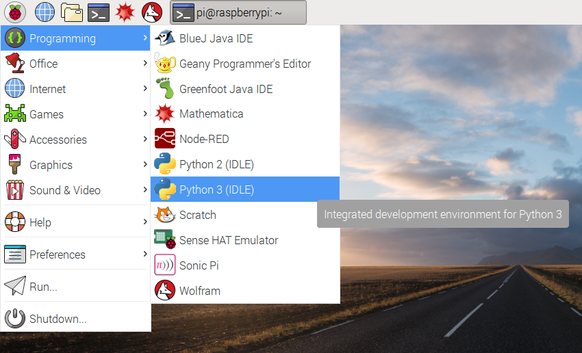

## Using set_pixel

First, we'll think up some random numbers and use the `set_pixel` function to place a random colour on a random location on the Sense HAT display.

- Start by opening Python 3 (IDLE) from the main menu:

    

- Create a new file by clicking `File > New file`.

- Save the new file as `sparkles.py`.

- In the new file, start by importing the Sense HAT module:

    ```python
    from sense_hat import SenseHat
    ```

- Next, create a connection to your Sense HAT by adding:

    ```python
    sense = SenseHat()
    ```

- Now think of a random number between 0 and 7 and assign it to the variable `x`, for example:

    ```python
    x = 4
    ```

- Think of another random number between 0 and 7, then assign it to `y`:

    ```python
    y = 5
    ```

- Think of three random numbers between 0 and 255, then assign them to `r`, `g`, and `b`:

    ```python
    r = 19
    g = 180
    b = 230
    ```

- Now use the `set_pixel` function to place your random colour at your random location on the display:

    ```python
    sense.set_pixel(x, y, r, g, b)
    ```

- Check over your code. It should look like this, with your own random numbers assigned to the variables:

    ```python
    from sense_hat import SenseHat

    sense = SenseHat()

    x = 4
    y = 5
    r = 19
    g = 180
    b = 230
    sense.set_pixel(x, y, r, g, b)
    ```
    <iframe src="https://trinket.io/embed/python/17a33cb9e7" width="100%" height="600" frameborder="0" marginwidth="0" marginheight="0" allowfullscreen></iframe>

- Now run your code by pressing `F5`. You should see a single pixel light up.

    *You might have guessed where the pixel would appear, and maybe you had an idea what colour it was going to be. The `x` and `y` are coordinates - the top-left corner pixel is `(0, 0)` and the bottom-right corner is `(7, 7)`. The `r`, `g` and `b` numbers are the red, green and blue parts of the colour. `(255, 0, 0)` would be pure red, `(0, 255, 0)` would be pure green, and `(255, 255, 0)` would be yellow.*

- Now pick some new random numbers - change them all - and run the program again. A second pixel should appear on the display!

