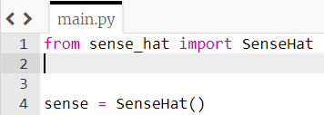

## Using the random module

So far you picked your own random numbers, but you can let the computer choose them instead.

+ Add another `import` line at the top of your program:

```python
from random import randint
```




+ Change your **x** and **y** variables to be equal to a random number between 0 and 7.

[[[generic-python-random]]]

+ Run your program again, and you should see another random pixel being placed on the display. It will be the same colour you chose previously.

+ Change your **r**, **g** and **b** variables to each be equal to a random number between 0 and 255. Now your program will automatically select a random colour.

+ Run the program again, and you should see another pixel appear in a random location with a random colour.

+ Run it a few more times, and you should see more of the grid fill up with random pixels.


