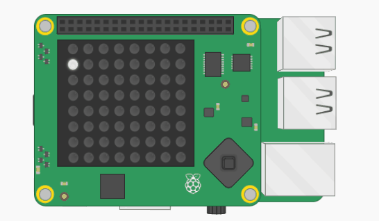

## Add a loop

Rather than have to keep running your program, you can add a loop so that it will keep going.

+ Add another `import` to the top of your file. You'll use this to pause the program between pixels.

```python
from time import sleep
```

+ Add an infinite loop on the line below the import statement

[[[generic-python-while-loop]]]

+ Indent all of the lines of code containing your variables and `set_pixel` so that they are within the loop:

--- hints ---
--- hint ---
An infinite loop will keep running the code inside it forever. Here is the code to begin an infinite loop. Don't forget that `True` must have a capital `T`.

```python
while True:
```
--- /hint ---

--- hint ---
Here is what your code should look like
```python
while True:
    x = randint(0, 7)
    y = randint(0, 7)
    r = randint(0, 255)
    g = randint(0, 255)
    b = randint(0, 255)
    sense.set_pixel(x, y, r, g, b)
```
--- /hint ---
--- /hints ---

+ Add line of code at the bottom of your program to pause for 0.1 seconds. Make sure that this line is indented level with the `set_pixel` line to show that it is inside the loop.

[[[generic-python-sleep]]]


+ Run the code and you should see random sparkles in action!


