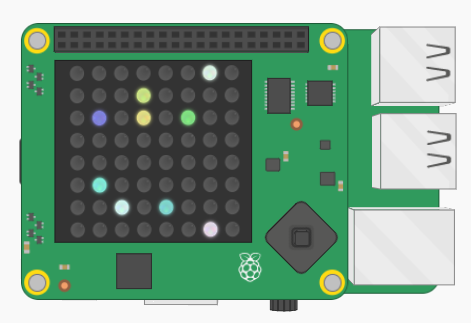

## `random` मॉड्यूल का उपयोग करना

अब तक आपने अपने स्वयं के यादृच्छिक संख्याओ को चुना है, लेकिन इसके बजाय आप कंप्यूटर को उन्हें चुनने दे सकते हैं `random` मॉड्यूल का उपयोग करके।

+ एक और `import` पंक्ति जोड़ें आपके प्रोग्राम के **शीर्ष** पर​:

```python
from random import randint
```

+ अपने `x ` और `y` वेरिएबल को बदलें 0 और 7 के बीच एक यादृच्छिक संख्या के बराबर होने के लिए। अब आपका प्रोग्राम स्वचालित रूप से LED मैट्रिक्स पर​ एक​ यादृच्छिक स्थान का चयन करेगा।

[[[generic-python-random]]]

+ अपने प्रोग्राम को फिर से चलाएं, और आपके डिस्प्ले पर एक और यादृच्छिक पिक्सेल रखा जाना चाहिए। यह वही रंग होगा जिसे आपने पहले चुना था।

+ अपने `r`, `g`, और `b` वेरिएबल को बदलें 0 और 255 के बीच एक यादृच्छिक संख्या के बराबर होने के लिए। अब आपका प्रोग्राम स्वचालित रूप से यादृच्छिक रंग का चयन करेगा।

+ प्रोग्राम को फिर से चलाएं, और आपको एक यादृच्छिक स्थान पर एक और पिक्सेल दिखाई देना चाहिए, इस बार एक यादृच्छिक रंग के साथ।

+ इसे कुछ और बार चलाएं, और आपको ग्रिड के अधिक स्थान यादृच्छिक पिक्सलों से भरते हुए दिखेंगे।

यदि आपके कोड मे `sense.clear()` पंक्ति है, तो आपको इसे हटाना होगा। अन्यथा, हर बार जब प्रोग्राम फिर से चलाया जाएगा, तो डिस्प्ले साफ़ हो जाएगा और आपका पिछला पिक्सेल गायब हो जाएगा।


