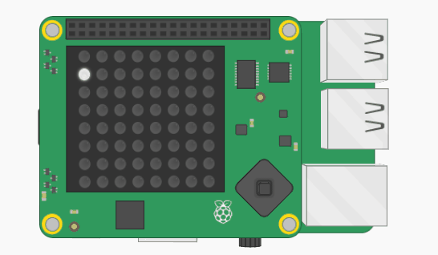

## 반복문 추가하기

<kbd>F5</kbd>을 눌러 프로그램을 계속 실행하는 대신 반복문을 추가하여 자체적으로 계속 실행되도록 할 수 있습니다.

+ `sleep` 모듈을 사용하여 픽셀 배치 사이에 프로그램을 일시 중지 할 수 있습니다. 이렇게 하려면, 먼저 파일 제일 상단에 `import`를 추가합니다.

```python
from time import sleep
```

+ `import` 문 하단에 무한 루프를 추가합니다.

[[[generic-python-while-true]]]

+ 변수와 `set_pixel`를 포함하는 모든 코드를 들여쓰기하여 반복문 안에 있도록 합니다.

--- hints --- --- hint ---

무한 루프는 내부의 코드를 영원히 계속 실행합니다. 다음은 무한 루프를 시작하는 코드입니다. `True` 에는 대문자 `T`가 있어야 한다는 것을 잊지 마십시오.

```python
while True:
```

--- /hint ---

--- hint ---

코드는 다음과 같아야 합니다:

```python
while True:
    x = randint(0, 7)
    y = randint(0, 7)
    r = randint(0, 255)
    g = randint(0, 255)
    b = randint(0, 255)
    sense.set_pixel(x, y, r, g, b)
```

--- /hint --- --- /hints ---

+ 프로그램 맨 아래에 코드 줄을 추가하여 0.1초 동안 일시 중지합니다. 이 줄이 `set_pixel` 줄과 들여쓰기가 같은지 확인하여 반복문 안에 있음을 확인합니다.

[[[generic-python-sleep]]]


+ 코드를 실행하면 무작위로 반짝이는 것을 볼 수 있습니다!


