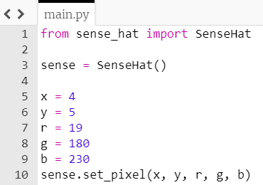

## Definindo pixels aleatoriamente

Primeiro, vamos pensar em alguns números aleatórios e usar a função `set_pixel` para colocar uma cor aleatória em uma posição aleatória no visor do Sense HAT.

+ Abrir o editor IDLE.

[[[rpi-gui-idle-opening]]]

+ Crie um novo arquivo e salve-o como `sparkles.py`.

+ No novo arquivo, comece importando o módulo `SenseHat`:

    ```python
    from sense_hat import SenseHat
    ```

+ Em seguida, crie uma conexão com seu Sense HAT adicionando esta linha de código:

    ```python
    sense = SenseHat()
    ```


Definiremos então x e y, para escolher qual pixel no Sense HAT será aceso.

+ Crie uma variável chamada `x` e defina como igual a um número de sua escolha entre 0 e 7. Essa será a coordenada x de seu pixel no visor. 
[[[generic-python-creating-a-variable]]]

+ Crie outra variável chamada `y` e defina como igual a outro número entre 0 e 7. Esta será a coordenada y de seu pixel no visor.


+ Para escolher a cor do seu pixel, pense em três números entre 0 e `255`, e atribua-os às variáveis chamadas `r`, `g` e `b`. Essas variáveis representarão a cor de seu pixel como quantidades de vermelho (r), verde (g), e azul (b).


+ Agora use a função `set_pixel` para colocar um pixel com sua cor escolhida aleatoriamente em sua posição escolhida aleatoriamente no visor.

**Nota:** as instruções que podem ser expandidas abaixo usam um nome de arquivo diferente do seu e usam Trinket em vez de IDLE.

[[[rpi-sensehat-single-pixel]]]

O método `set_pixel` recebe dados na seguinte ordem: coordenada x, coordenada y, vermelho, verde, azul

Para definir seu método `set_pixel`, coloque os nomes de suas variáveis no lugar dos pontos de interrogação nesta linha de código, na ordem certa: coordenada x, coordenada y, vermelho, verde, azul.

```python
sense.set_pixel(?, ?, ?, ?, ?)
```

Veja a dica abaixo se você estiver travado.

--- hints ---


--- hint ---

Aqui está como seu código final deve ficar — você provavelmente terá escolhido diferentes números:



--- /hint ---

--- /hints ---


+ Execute seu código pressionando <kbd>F5</kbd>. Você deve ver uma única luz de LED acesa na matriz de LED do Sense HAT.

+ Agora altere todos os números do seu programa e execute o programa novamente. Um segundo LED deve estar aceso.
