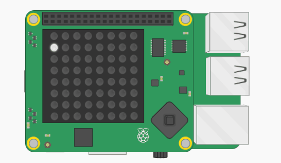

## Adicione um laço

Ao invés de executar seu programa várias vezes pressionando <kbd>F5</kbd>, você pode adicionar um laço para que ele continue rodando sozinho.

+ Você pode utilizar o módulo `sleep` para pausar o programa entre pixels. Para fazer isso, primeiro adicione outro `import` no topo do seu arquivo.

```python
from time import sleep
```

+ Adicione um laço infinito na linha abaixo dos comandos `import`.

[[[generic-python-while-true]]]

+ Indente todas as linhas de código que contêm suas variáveis e `set_pixel` para que elas estejam dentro do laço:

--- hints ---
 --- hint ---

Um laço infinito continuará executando o código dentro dele para sempre. Aqui está o código para começar um laço infinito. Não se esqueça de que `True` deve ter uma letra maiúscula `T`.

```python
while True:
```

--- /hint ---

--- hint ---

Aqui está como seu código deve se parecer:

```python
while True:
    x = randint(0, 7)
    y = randint(0, 7)
    r = randint(0, 255)
    g = randint(0, 255)
    b = randint(0, 255)
    sense.set_pixel(x, y, r, g, b)
```

--- /hint ------ /hints ---

+ Adicione uma linha de código na parte inferior do seu programa para pausar por 0,1 segundo. Certifique-se de que esta linha esteja indentada com a linha `set_pixel` para mostrar que está dentro do laço.

[[[generic-python-sleep]]]


+ Execute o código e você verá brilhos aleatórios em ação!


