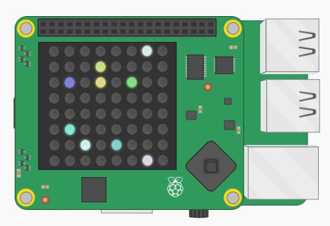

## Використання модуля `random`

Поки що ти підбирав(-ла) власні випадкові числа, але ти можеш дозволити комп'ютеру вибирати їх замість тебе, використовуючи модуль `random`.

+ Додай ще один рядок `import` у **верхній** частині програми:

```python
from random import randint
```

+ Модифікуй змінні `x` та `y` так, щоб вони були випадковими числами від 0 до 7. Тепер твоя програма буде автоматично вибирати випадкову позицію на світлодіодній матриці.

[[[generic-python-random]]]

+ Запусти програму ще раз, і на Sense HAT дисплеї повинен з’явитися ще один випадковий піксель. Він буде такого ж кольору, який ти вибрав(-ла) перед цим.

+ Модифікуй змінні `r`, `g` та `b` так, щоб вони були випадковими числами від 0 до 255. Тепер твоя програма буде автоматично вибирати випадковий колір.

+ Запусти програму ще раз, і ти маєш побачити ще один піксель у випадковому місці, на цей раз випадкового кольору.

+ Запусти програму ще кілька разів, і ти маєш побачити, що все більша частина сітки матриці заповнюється випадковими пікселями.

Якщо у тебе є рядок `sense.clear()` у коді, його потрібно видалити. В іншому випадку, кожного разу при повторному запуску програми дисплей буде очищений, а твій попередній піксель зникне.


